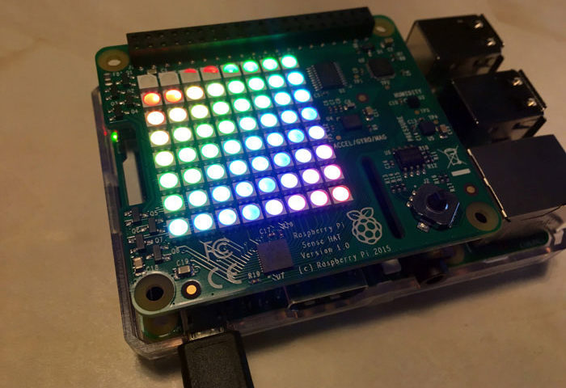

#    Tecnológico Nacional de México
#   Instituto Tecnológico de Tijuana
#        Subdirección Académica
# Departamento de Sistemas y Computación
##  Ingeniería en Sistemas Computacionales
##        SISTEMAS PROGRAMABLES
##   Profesor: MC. René Solis Reyes
##     Semestre Ago - Dic 2021
----
# Practica: 2.1 Preparando el NODO intermedio (antes que el microcontrolador) con Sense-HAT en un Pi4
# Bloque: 2
# Objetivo:  Conocer el funcionamiento de sense hat
----

# 📝 Apellido, Nombre y Num Control
# Martinez Estrada Ana Karen 16320885

# ¿Qué es Sense Hat?
El Sense HAT es una placa complementaria para Raspberry Pi, hecha especialmente para la   misión Astro Pi (se lanzó a la Estación Espacial Internacional en diciembre de 2015)que permite medirtemperatura, humedad, presión y orientación, y mostrar información en su matriz de LED. 

El Sense HAT tiene una matriz de LED RGB de 8 × 8, un joystick de cinco botones, la matriz LED de Sense HAT contiene 64 LED multicolor. Dentro de cada uno de esos 64 LED
hay tres LED más pequeños: uno rojo, uno verde y uno azul, igual que en la pantalla del televisor o de un teléfono móvil inteligente.e incluye los siguientes sensores:

Giroscopio
Acelerómetro
Magnetómetro
Temperatura
Presión barométrica
Humedad

